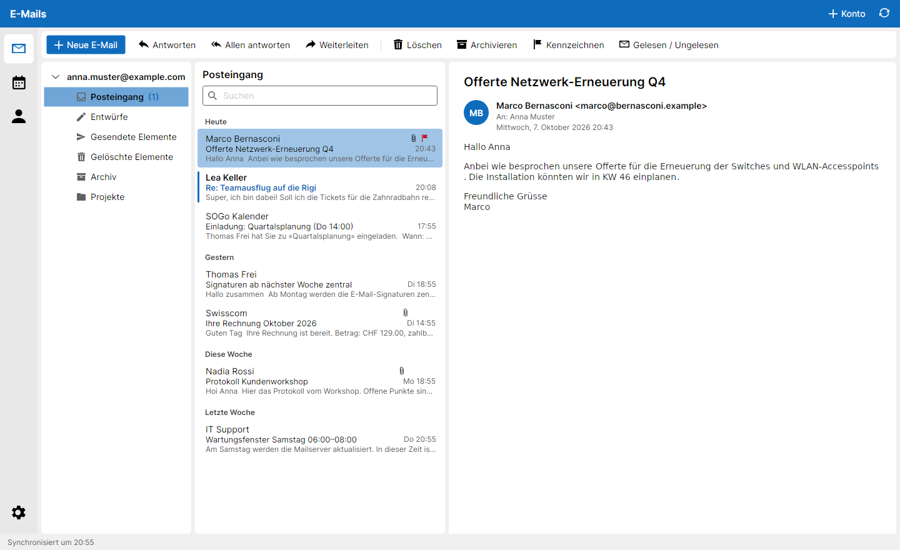

# Neruna Desktop

E-Mail, Kalender und Kontakte in einer App – vertraut wie im Büro, offen für IMAP/SMTP, CalDAV, CardDAV und ICS.
Gratis und Open Source. Deine Daten bleiben auf deinem Server: Neruna betreibt kein Daten-Hosting.

**Website:** [neruna.org](https://neruna.org) · **Lizenz:** [MPL 2.0](LICENSE) · **Stack:** .NET 10, Avalonia 12,
MailKit/MimeKit, SQLite



Architektur, Leitplanken und offene Entscheide: [`docs/architecture.md`](docs/architecture.md).

## Repositories

| Repo | Inhalt |
|---|---|
| **neruna-desktop** (dieses) | Client, Tests, Testlabor, Werkzeuge |
| **neruna-api** | API-Vertrag zwischen Client und Server (OpenAPI + Beispieldaten), von beiden Seiten getestet |
| neruna-server | Neruna Cloud / Control (nicht öffentlich) |
| neruna-website | Produktwebsite neruna.org |

Die Tests brauchen den API-Vertrag: entweder als Nachbarordner `../api` (alle Repos nebeneinander ausgecheckt)
oder als Git-Submodul `api/` in diesem Repo (`git submodule add <url-von-neruna-api> api`).

## Entwickeln

Voraussetzung zum Entwickeln: .NET 10 SDK (`global.json`).

```sh
dotnet run --project src/Client/Neruna.Desktop -- --demo   # Beispieldaten, eigener Datenordner
dotnet run --project src/Client/Neruna.Desktop             # echte Konten
dotnet test                                                # alle .NET-Tests
```

**Funktionsumfang (Stand):** IMAP/SMTP (Lesen als HTML mit eingebetteten Bildern – externe Bilder blockiert bis «Bilder laden» –,
Senden, Antworten/Allen antworten/Weiterleiten, Anhänge inkl. Inline-PDF und winmail.dat öffnen/speichern/anhängen,
Löschen → Gelöschte Elemente, Archivieren, Kennzeichnen, Gelesen/Ungelesen), S/MIME (Zertifikatsverwaltung, Signieren,
Verschlüsseln, Prüfen, Entschlüsseln, Zertifikate aus signierten Mails automatisch übernehmen), CalDAV (Wochenansicht, Termine
anlegen/bearbeiten/verschieben/löschen, Serien), CardDAV (Kontakte anlegen/bearbeiten/löschen; unbekannte vCard-Felder
bleiben erhalten), ICS-Abos, Konto-Erkennung (Autoconfig, ISPDB, `/.well-known`), Kontenverwaltung, Logs.

Tastenkürzel Mail: `Ctrl+N` neu, `Ctrl+R` antworten, `Ctrl+Shift+R` allen antworten, `Ctrl+F` weiterleiten,
`Entf` löschen, `Ctrl+Q` gelesen/ungelesen, `Ctrl+Enter` senden, `F5` synchronisieren.

### Ausführbare Version bauen (auch für Windows, direkt unter Linux)

```sh
scripts/publish.sh win-x64      # → artifacts/neruna-win-x64.zip  (eine neruna.exe, ohne .NET-Installation lauffähig)
scripts/publish.sh linux-x64    # ebenso osx-arm64, osx-x64, win-arm64
```

Die Builds sind nicht signiert (Windows SmartScreen: «Weitere Informationen» → «Trotzdem ausführen»).

### Testen gegen echte Server

**Testlabor** (GreenMail + Radicale, nur fürs lokale Netz):

```sh
docker-compose -f tools/testlab/docker-compose.yml up -d
tools/testlab/seed.sh            # Kalender, Adressbuch, Beispielmails für anna@example.com
```

Im Client «Konto hinzufügen»: `anna@example.com` / `geheim`, dann bei «Servereinstellungen»
IMAP `<host>` Port `3143` und SMTP `<host>` Port `3025` jeweils **Keine (unverschlüsselt)**,
CalDAV und CardDAV `http://<host>:5232/`. Weitere Konten: `lea@example.com`, `marco@example.com`.

**S/MIME im Testlabor:** `tools/testlab/make-certs.sh` erzeugt eine Test-CA und Zertifikate (Passwort jeweils `geheim`)
in `tools/testlab/certs/`. Im Client unter Einstellungen → Zertifikate (S/MIME) importieren: `anna.p12` (eigenes),
`testlab-ca.crt` (Zertifizierungsstelle, damit Signaturen als vertrauenswürdig gelten), optional `lea.crt`/`marco.crt`
(Kontakte) und `expired.p12` (abgelaufen, zum Testen der Statusanzeige). Signierte/verschlüsselte Testmails erzeugt der
Live-Durchlauf (siehe unten) oder ein zweiter Neruna-Client mit dem Konto `marco@example.com`.

**Eigene Server** (SOGo, Nextcloud, Mailcow …): einfach mit der echten Adresse einrichten. Für SOGo ist die DAV-Adresse
typischerweise `https://<server>/SOGo/dav/`, für Nextcloud `https://<server>/remote.php/dav/` – meist findet Neruna sie
über `/.well-known` selbst.

**Fehlersuche:** Logs liegen im Datenordner unter `logs/` (Bereich «Konten» → «Diagnose» → «Öffnen»).
Mit `--protocol-log` (oder `NERUNA_PROTOCOL_LOG=1`) werden zusätzlich IMAP/SMTP-Mitschnitte (`logs/protocol/`) und
DAV-Anfragen/-Antworten geschrieben; Passwörter sind darin geschwärzt, Inhalte von Mails/Terminen aber nicht.

Daten: `%LOCALAPPDATA%\Neruna`, `~/.local/share/Neruna` bzw. `~/Library/Application Support/Neruna`
(überschreibbar mit `NERUNA_DATA_DIR`; `--demo` nutzt den Unterordner `demo`).

**Automatische Integrationstests** (laufen sonst als «übersprungen»):

```sh
docker-compose -f tools/testlab/docker-compose.yml up -d
NERUNA_TEST_IMAP_HOST=127.0.0.1 NERUNA_TEST_DAV_URL=http://127.0.0.1:5232/ dotnet test
```

**Screenshots / UI-Prüfung ohne Bildschirm:**
`dotnet run --project tools/Neruna.Desktop.Snapshot -- docs/screenshots` (Demo-Daten) bzw.
`… -- <ordner> light --live 127.0.0.1 http://127.0.0.1:5232/` (Ende-zu-Ende gegen das Testlabor).

**Editor (JavaScript) testen** – Playwright in Docker, Chromium und WebKit:

```sh
docker run --rm -v "$PWD":/work -w /work mcr.microsoft.com/playwright/python:v1.55.0-noble \
  sh -c "pip install -q pytest pytest-playwright playwright==1.55.0 && pytest -q -p no:cacheprovider tests/editor"
```

Für das formatierte Verfassen braucht Neruna eine WebView-Laufzeit: unter Windows **WebView2** (ab Windows 11
vorinstalliert), unter Linux **WebKitGTK** 4.0 oder 4.1 (Debian/Ubuntu: `libwebkit2gtk-4.1-0`). Fehlt sie, wird als reiner Text geschrieben.

Avalonia sendet beim Build Telemetrie; abschalten mit `AVALONIA_TELEMETRY_OPTOUT=1`.


## Lizenz

Copyright © 2026 Neruna contributors
Licensed under the [Mozilla Public License 2.0](LICENSE).

Du darfst den Code nutzen, verändern und weitergeben; Änderungen an Neruna-Dateien müssen unter der MPL offen bleiben.
Verwendete Bibliotheken und ihre Lizenzen: [`THIRD-PARTY-NOTICES.md`](THIRD-PARTY-NOTICES.md).

**Name und Logo sind nicht Teil der Lizenz:** «Neruna» und das Neruna-Logo sind Marken von Patrik Zimmermann. Forks
sind willkommen, brauchen aber einen eigenen Namen und ein eigenes Logo – siehe [`TRADEMARKS.md`](TRADEMARKS.md).

Mitwirken: [`CONTRIBUTING.md`](CONTRIBUTING.md) · Sicherheitslücken melden: [`SECURITY.md`](SECURITY.md)
